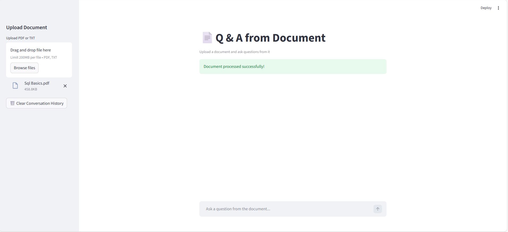

# # 📄 DocuMind | AI-Powered Document Intelligence (RAG)
### Retrieval-Augmented Generation (RAG) System for Document Question Answering

An AI-powered application that allows users to upload documents (PDF/TXT) and ask questions directly from their content using a Retrieval-Augmented Generation (RAG) pipeline.

---

##  Live Demo
🔗 Live Demo: (Deployment in progress – Streamlit Cloud)

---
## 🖥️ Application Preview



##  Project Overview

DocumentGPT is built to demonstrate a production-style RAG architecture using:

- Semantic Search (FAISS)
- Sentence Embeddings (HuggingFace)
- LLaMA 3.1 via Groq
- Prompt Engineering
- Streamlit UI

The system ensures responses are generated strictly from the uploaded document to reduce hallucination.

---

##  System Architecture

      
            Uploaded File  
                      ↓
            Text Splitting (Chunks)
                      ↓
            Embeddings Generation
                      ↓
                FAISS Vector DB
                      ↓
            User Question → Embedding → Similarity Search
                      ↓
            Retrieved Context
                      ↓
            LLaMA 3.1 (Groq)
                     ↓
            Final Answer

1. The uploaded document is split into overlapping chunks.
2. Each chunk is converted into a vector embedding.
3. Vectors are stored inside a FAISS index.
4. When a user asks a question:
   - The question is embedded.
   - Similar chunks are retrieved.
   - Retrieved context is passed to LLaMA 3.1.
5. The model generates an answer strictly based on retrieved context.

## 🛠 Tech Stack

| Layer | Technology |
|-------|------------|
| Frontend | Streamlit |
| LLM | LLaMA 3.1 (Groq API) |
| Embeddings | sentence-transformers/all-MiniLM-L6-v2 |
| Vector DB | FAISS |
| Framework | LangChain |
| Language | Python |

---

## Key Features

- Upload PDF or TXT documents
- Semantic similarity search
- RAG-based answering
- Chat-style conversation
- Hallucination control via prompt design
- Session-based conversation memory
- Source citation with page reference
- Cached embeddings for performance optimization
- Configurable retrieval parameters (chunk size, top-k)
- Persistent FAISS index
---

## why This Project Matters

This project demonstrates:

- Real-world RAG implementation
- Vector database integration
- LLM orchestration using LangChain
- Prompt engineering techniques
- End-to-end AI system design

---

## ⚙️ Installation & Setup

```bash
git clone https://github.com/MohamedMahmoud07/Q-A.git
cd Q-A
pip install -r requirements.txt
```

Create a `.env` file:

```
GROQ_API_KEY=your_api_key_here
HF_TOKEN=your_huggingface_token
```

Run locally:

```bash
streamlit run app.py
```

##  Challenges & Solutions

- Preventing hallucination → Controlled prompt design
- Optimizing retrieval accuracy → Chunk size tuning (500/100 overlap)
- Performance optimization → Using MiniLM embeddings

## Production Considerations
- Caching embeddings to avoid re-computation
- Similarity threshold to reduce hallucination
- Modular pipeline design
- Scalable architecture for multi-document support
- API-based LLM integration (Groq)

##  Future Improvements
- Docker deployment
- Authentication system
- Arabic optimized embeddings
- Multi-document support
- Evaluation metrics for retrieval quality

